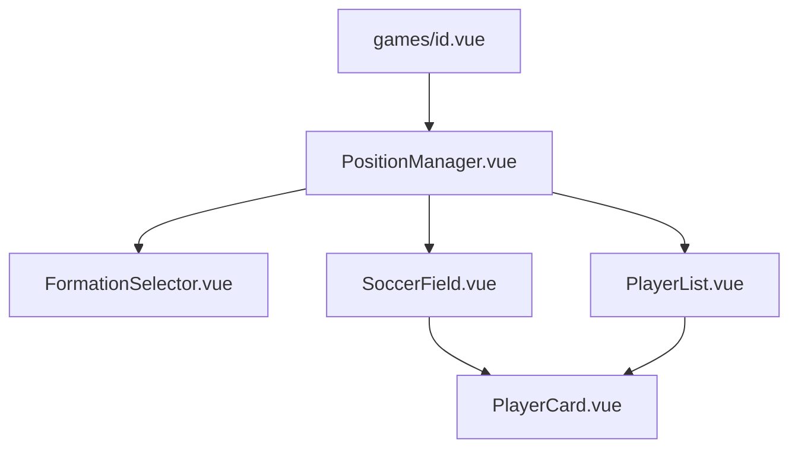
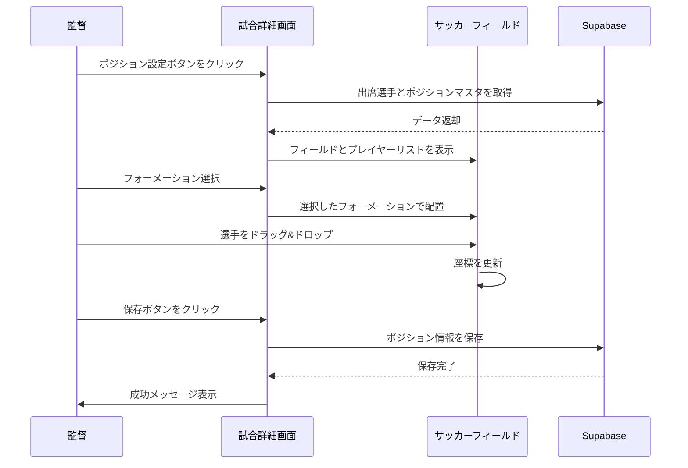

# ポジション設定機能実装計画

## 概要

試合詳細ページ（[`app/pages/games/[id].vue`](app/pages/games/[id].vue)）に、監督がビジュアルなサッカーフィールド上で選手のポジションを設定できる機能を実装します。

## 技術仕様

### データベース構造

- **positionsテーブル**: 既存のマスタデータを使用
- **attendancesテーブル**: 以下のカラムを追加
- `position_id` (FK to positions): 選手の割り当てポジション
- `field_x` (float): フィールド上のX座標（0-100%）
- `field_y` (float): フィールド上のY座標（0-100%）
- `is_starter` (boolean): スターティングメンバーか控えか

### フォーメーション定義

プリセットフォーメーション（4-4-2、4-3-3、3-5-2など）を定数として定義し、各ポジションの初期座標を含める。

```typescript
const FORMATIONS = {
  '4-4-2': {
    GK: { x: 50, y: 5 },
    LB: { x: 20, y: 25 },
    CB1: { x: 40, y: 20 },
    CB2: { x: 60, y: 20 },
    RB: { x: 80, y: 25 },
    // ... 他のポジション
  },
  // ... 他のフォーメーション
}
```

## 実装内容

### 1. データベースマイグレーション

`attendances`テーブルに新しいカラムを追加：

- `position_id` (uuid, nullable, FK)
- `field_x` (float, nullable)
- `field_y` (float, nullable)
- `is_starter` (boolean, default: true)

### 2. コンポーネント構成



#### 新規作成コンポーネント

**`app/components/PositionManager.vue`**

- ポジション設定機能全体を管理
- フォーメーション選択、フィールド表示、選手リストを統合
- 監督のみ表示・編集可能、選手は閲覧のみ

**`app/components/FormationSelector.vue`**

- プリセットフォーメーション選択UI
- ドロップダウンまたはカード形式で表示

**`app/components/SoccerField.vue`**

- サッカーフィールドの描画
- ドラッグ&ドロップ機能の実装
- HTML5 Drag and Drop APIを使用
- レスポンシブ対応（スマホではタッチイベント対応）

**`app/components/PlayerCard.vue`**

- フィールド上およびリスト内の選手カード
- アバター、名前、ポジション表示
- ドラッグ可能な状態管理

**`app/components/PlayerList.vue`**

- 未配置選手および控え選手のリスト
- 出席選手のみ表示
- ドラッグ元として機能

### 3. 状態管理

[`app/pages/games/[id].vue`](app/pages/games/[id].vue)に以下を追加：

```typescript
// ポジション設定用の状態
const isEditingPositions = ref(false)
const selectedFormation = ref('4-4-2')
const playerPositions = ref<Map<string, PlayerPosition>>()
const availablePositions = ref<Position[]>([])

interface PlayerPosition {
  playerId: string
  positionId: string
  fieldX: number
  fieldY: number
  isStarter: boolean
}

// ポジションマスタを取得
const fetchPositions = async () => {
  const { data, error } = await supabase
    .from('positions')
    .select('*')
  
  if (!error && data) {
    availablePositions.value = data
  }
}

// ポジション情報を保存
const savePositions = async () => {
  // playerPositionsをattendancesテーブルに保存
}
```

### 4. UI/UXフロー



### 5. レスポンシブ対応

**デスクトップ（PC）:**

- フィールドとプレイヤーリストを横並び表示
- ドラッグ&ドロップで直感的な操作

**スマートフォン:**

- フィールドとプレイヤーリストを縦並び表示
- タッチイベントでドラッグ対応
- フィールドサイズを画面幅に合わせて調整

### 6. 実装ファイル一覧

1. **データベース**: Supabaseコンソールで`attendances`テーブルを更新
2. **[`app/pages/games/[id].vue`](app/pages/games/[id].vue)**: ポジション設定セクションを追加
3. **`app/components/PositionManager.vue`**: 新規作成
4. **`app/components/FormationSelector.vue`**: 新規作成
5. **`app/components/SoccerField.vue`**: 新規作成
6. **`app/components/PlayerCard.vue`**: 新規作成
7. **`app/components/PlayerList.vue`**: 新規作成
8. **`app/composables/useFormations.ts`**: フォーメーション定義（新規作成）

## 実装順序

1. データベースマイグレーション（`attendances`テーブル更新）