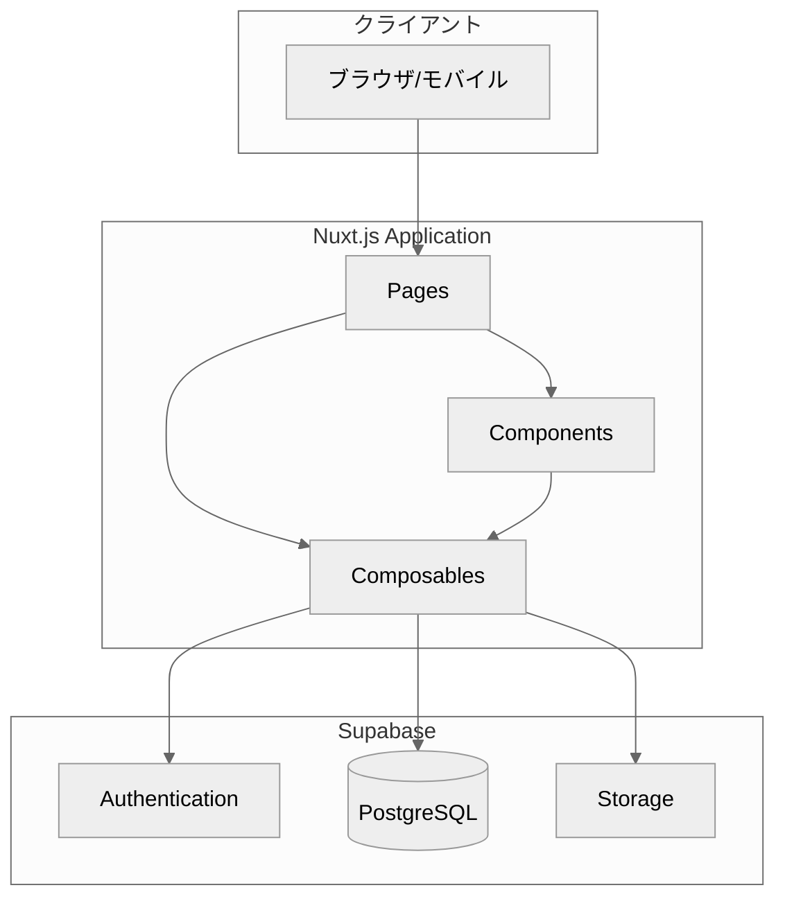
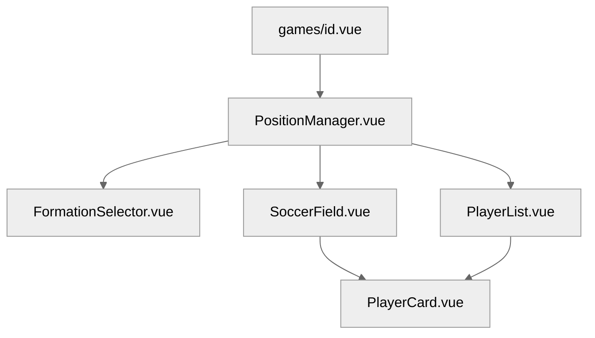

# MatchMate 設計書

## 概要
**MatchMate**は、サッカーチーム向けの試合出欠管理およびポジション設定アプリケーションです。
監督と選手が効率的にコミュニケーションを取り、試合の準備を円滑に進めることができます。
MatchMateアプリケーションの設計ドキュメントは##ドキュメント一覧を参照ください。

## 開発背景
所属する社会人サッカーチームでの管理の不便を解消したいという思いから、エンジニア転職前の未経験時代に
Laravelで開発した[League-management(Github)](https://github.com/ryousukemizokami/League-Management)を、フルリメイクしました。
当時は実装できなかった管理者機能や承認フローを完備し、過去の自分へのリベンジも込めて形にしたプロダクトです。

## ドキュメント一覧

| ファイル | 説明 |
|----------|------|
| [01_システム概要.md](/docs/design/01_システム概要.md) | プロジェクト概要、技術スタック、アーキテクチャ |
| [02_機能要件.md](/docs/design/02_機能要件.md) | ユーザーロール、機能一覧、ビジネスルール |
| [03_データベース設計.md](/docs/design/03_データベース設計.md) | ER図、テーブル定義、RLS設計 |
| [04_画面設計.md](/docs/design/04_画面設計.md) | 画面一覧、画面遷移図、ワイヤーフレーム |
| [05_コンポーネント設計.md](/docs/design/05_コンポーネント設計.md) | コンポーネント構成、Props/Emits定義、Composables |
| [06_API設計.md](/docs/design/06_API設計.md) | Supabaseクエリパターン、データ操作フロー |
| [07_非機能要件.md](/docs/design/07_非機能要件.md) | パフォーマンス、セキュリティ、レスポンシブ対応 |

## 技術スタック概要

```
フロントエンド: Nuxt.js 4 + Vue 3 + TypeScript + Tailwind CSS
バックエンド: Supabase (Authentication, Database, Storage)
ホスティング: Vercel
```

## 主要機能

### 共通機能
- ユーザー登録・ログイン
- プロフィール編集
- チーム選択

### 監督機能
- チーム作成・管理
- 試合作成・編集・削除
- 選手の加入承認/却下
- **ポジション設定**（ビジュアルフィールド上でドラッグ&ドロップ）

### 選手機能
- チーム加入申請
- 出欠回答
- スケジュール確認
- ポジション確認

## アーキテクチャ図



## ディレクトリ構成

```
matchmate/
├── app/
│   ├── components/     # 再利用可能コンポーネント
│   ├── composables/    # Composition API関数
│   ├── layouts/        # レイアウト
│   ├── middleware/     # ミドルウェア
│   └── pages/          # ページコンポーネント
├── server/
│   └── api/            # サーバーサイドAPI
├── public/             # 静的ファイル
└── docs/
    └── design/         # 設計ドキュメント
```

## ポジション設定機能

MatchMateの特徴的な機能である「ポジション設定」は、以下のコンポーネントで構成されています：



### 主な機能
- **フォーメーション選択**: 4-4-2, 4-3-3, 3-5-2, 4-2-3-1, 3-4-3
- **編集モード**: 
  - 交換モード（2選手をクリックして位置交換）
  - ドラッグモード（自由に位置調整）
- **スタメン/サブ管理**: 最大11人のスタメン配置

## 更新履歴

| 日付 | 内容 |
|------|------|
| 2026-03-21 | 初版作成 |

