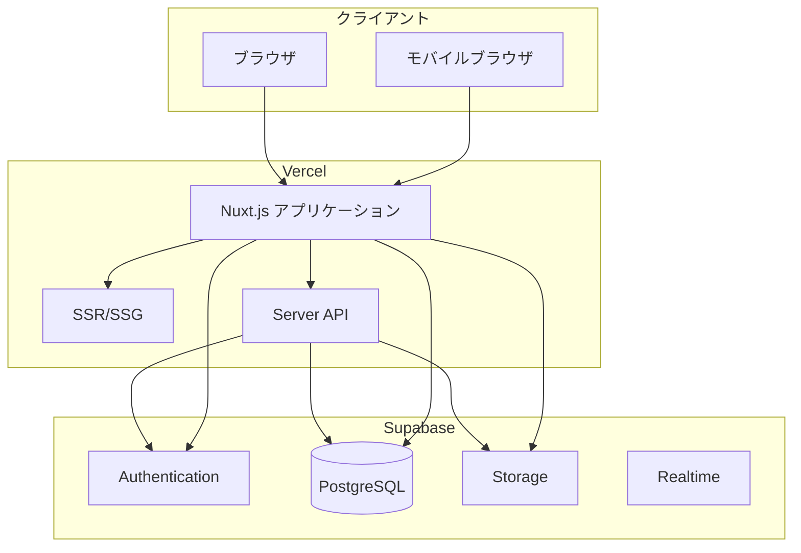
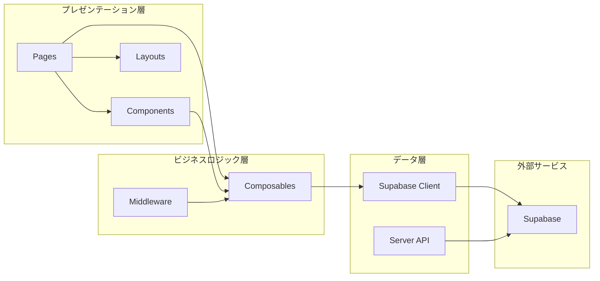

# 1. システム概要

## 1.1 プロジェクト概要

### アプリケーション名
**MatchMate**（マッチメイト）

### 概要
MatchMateは、サッカーチーム向けの試合出欠管理およびポジション設定アプリケーションです。監督と選手が効率的にコミュニケーションを取り、試合の準備を円滑に進めることができます。

### 主な目的
- チームメンバーの出欠管理の効率化
- 試合スケジュールの一元管理
- ビジュアルなポジション配置機能による戦術共有
- 監督・選手間のスムーズな情報伝達

## 1.2 技術スタック

### フロントエンド
| 技術 | バージョン |
|------|-----------|
| Nuxt.js | 4.1.3 |
| Vue.js | 3.5.22 |
| TypeScript | 5.9.3 |
| Tailwind CSS | 4.1.17 |
| Nuxt UI | 4.1.0 |

### バックエンド・インフラ
| 技術 | 用途 |
|------|------|
| Supabase | BaaS（認証、データベース、ストレージ） |
| Vercel | ホスティング・デプロイ |
| PostgreSQL | データベース（Supabase経由） |

### 開発ツール
| 技術 | 用途 |
|------|------|
| Git/GitHub | バージョン管理 |
| ESLint | コード品質管理 |
| Nuxt DevTools | 開発支援 |

## 1.3 システムアーキテクチャ

### 全体構成図



### レイヤー構成



## 1.4 ディレクトリ構成

```
matchmate/
├── app/
│   ├── app.vue                 # ルートコンポーネント
│   ├── assets/
│   │   ├── css/
│   │   │   └── tailwind.css    # Tailwind CSS設定
│   │   └── images/             # 画像アセット
│   ├── components/             # 再利用可能コンポーネント
│   │   ├── FormationSelector.vue
│   │   ├── PlayerCard.vue
│   │   ├── PlayerList.vue
│   │   ├── PositionManager.vue
│   │   └── SoccerField.vue
│   ├── composables/            # Composition API関数
│   │   ├── useFormations.ts
│   │   ├── useSupabaseClient.ts
│   │   ├── useTeamSession.ts
│   │   └── useUserRole.ts
│   ├── layouts/
│   │   └── default.vue         # デフォルトレイアウト
│   ├── middleware/
│   │   └── managerOnly.ts      # 監督専用ミドルウェア
│   └── pages/                  # ページコンポーネント
│       ├── games/
│       │   └── [id].vue        # 試合詳細ページ
│       ├── manager/
│       │   ├── games/
│       │   │   └── game_create.vue
│       │   └── teams/
│       │       └── create.vue
│       ├── index.vue
│       ├── login.vue
│       ├── register.vue
│       ├── profile.vue
│       ├── schedule.vue
│       ├── team_info.vue
│       ├── team_join.vue
│       ├── team_select.vue
│       └── team_top.vue
├── server/
│   └── api/
│       └── login.ts            # サーバーサイドAPI
├── public/                     # 静的ファイル
├── docs/
│   └── design/                 # 設計ドキュメント
├── nuxt.config.ts              # Nuxt設定
├── package.json
└── tsconfig.json
```

## 1.5 主要な設計方針

### 1. コンポーネント指向設計
- 再利用可能な小さなコンポーネントに分割
- Props/Emitによる明確なインターフェース定義
- Composition APIによる状態管理

### 2. 型安全性
- TypeScriptによる型定義
- インターフェースによるデータ構造の明確化

### 3. レスポンシブデザイン
- モバイルファーストアプローチ
- Tailwind CSSによる柔軟なレイアウト
- タッチデバイス対応

### 4. セキュリティ
- Supabase Authによる認証
- Row Level Security（RLS）によるデータアクセス制御
- ロールベースの機能制限

### 5. ユーザー体験
- 直感的なドラッグ&ドロップ操作
- リアルタイムなフィードバック
- 適切なエラーハンドリングとメッセージ表示
