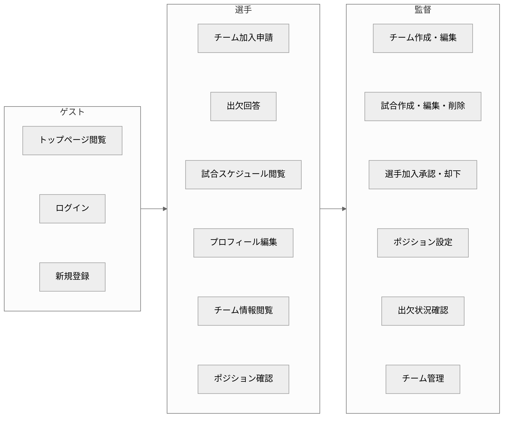
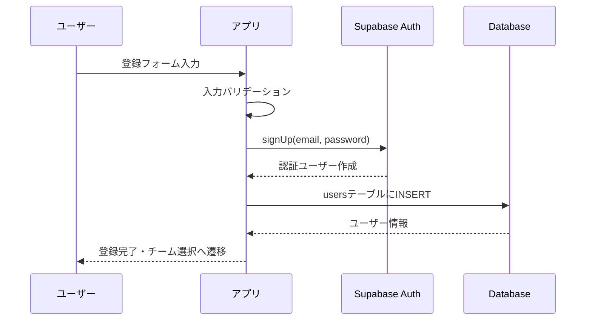
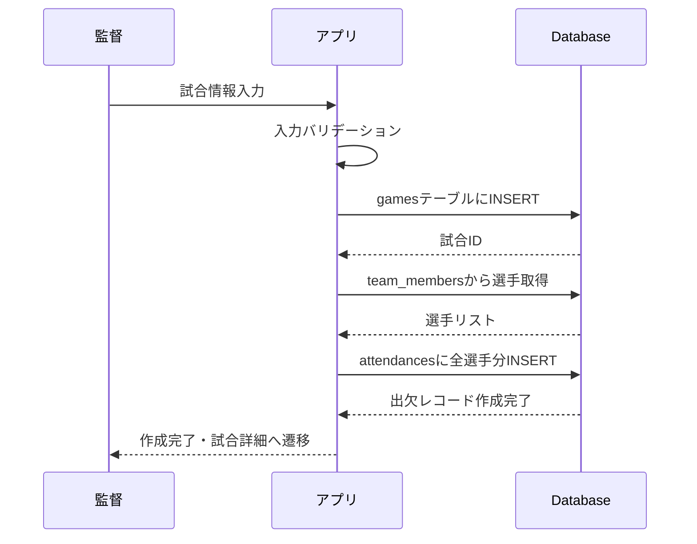
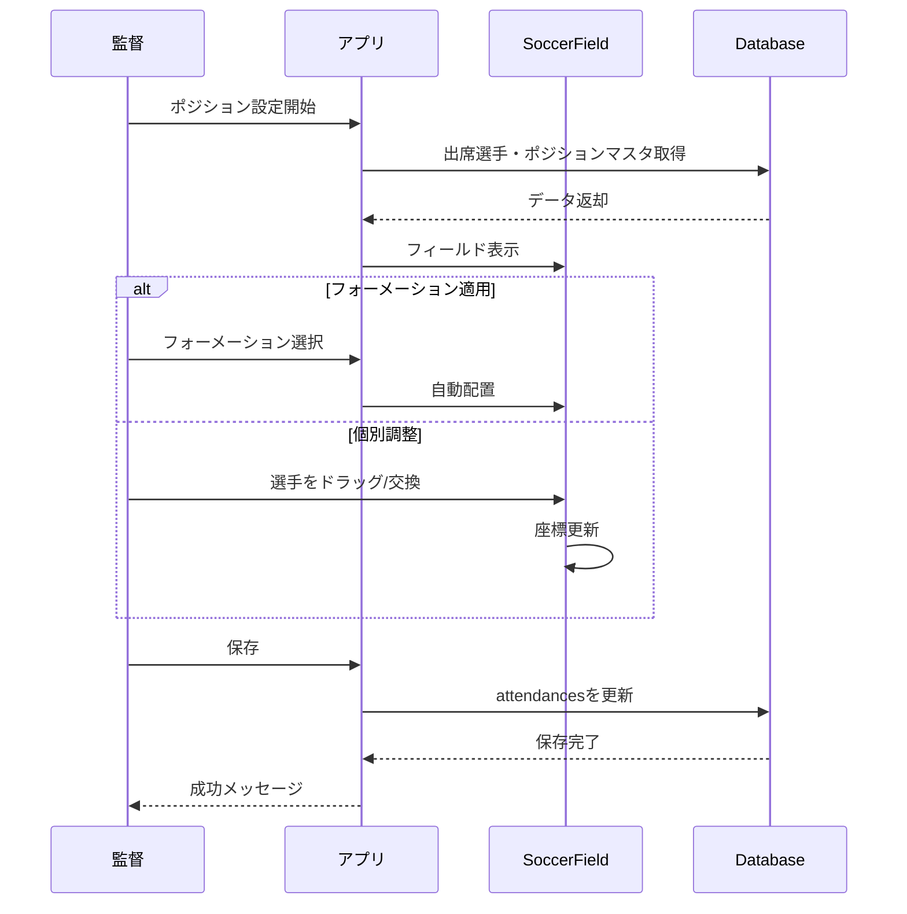
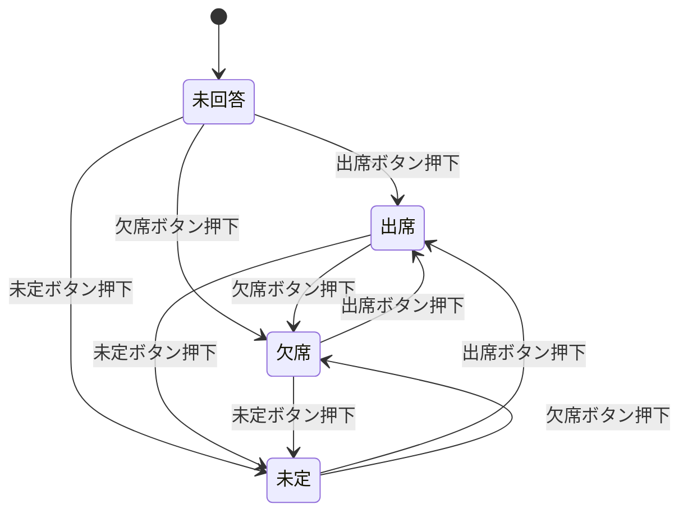

# 2. 機能要件

## 2.1 ユーザーロール定義

### ロール一覧

| ロール | 説明 | 権限レベル |
|--------|------|-----------|
| 監督（Manager） | チームを管理する責任者 | 高 |
| 選手（Player） | チームに所属するメンバー | 標準 |
| ゲスト（未認証） | 未ログインユーザー | 低 |

### ロール別機能アクセス権限
##### ※機能内容については後に記載

## 2.2 機能一覧

### 共通機能

| 機能ID | 機能名 | 説明 |
|--------|--------|------|
| C-001 | ユーザー登録 | メールアドレスでの新規ユーザー登録 |
| C-002 | ログイン | メールアドレス・パスワードでの認証 |
| C-003 | ログアウト | セッション終了 |
| C-004 | プロフィール編集 | ユーザー名、アバター画像の編集 |
| C-005 | チーム選択 | 所属チームの切り替え |

### 監督専用機能

| 機能ID | 機能名 | 説明 |
|--------|--------|------|
| M-001 | チーム作成 | 新規チームの作成 |
| M-002 | チーム編集 | チーム名、ロゴ、住所の編集 |
| M-003 | 試合作成 | 新規試合スケジュールの登録 |
| M-004 | 試合編集 | 試合情報の更新 |
| M-005 | 試合削除 | 試合情報の削除 |
| M-006 | 選手承認 | 加入申請の承認 |
| M-007 | 選手却下 | 加入申請の却下 |
| M-008 | 選手除名 | 所属選手の除名 |
| M-009 | ポジション設定 | フォーメーション選択・選手配置 |
| M-010 | 出欠確認 | チーム全体の出欠状況確認 |

### 選手専用機能

| 機能ID | 機能名 | 説明 |
|--------|--------|------|
| P-001 | チーム加入申請 | 希望チームへの加入申請 |
| P-002 | 出欠回答 | 試合への出席・欠席・未定の回答 |
| P-003 | スケジュール確認 | 試合スケジュールの確認 |
| P-004 | ポジション確認 | 自分のポジション配置の確認 |

## 2.3 機能詳細仕様

### C-001: ユーザー登録

**入力項目:**
- メールアドレス（必須）
- パスワード（必須、6文字以上）
- ユーザー名（必須）
- ロール選択（監督/選手）

**バリデーション:**
- メールアドレス形式チェック
- パスワード長チェック（6文字以上）
- 必須項目チェック

### M-003: 試合作成

**入力項目:**
- 対戦相手（必須）
- 試合日（必須）
- 試合時間（必須）
- 場所（任意）
- 備考（任意）

### M-009: ポジション設定

**機能詳細:**

1. **フォーメーション選択**
   - プリセット: 4-4-2, 4-3-3, 3-5-2, 4-2-3-1, 3-4-3
   - 選択時に自動で選手を配置

2. **編集モード**
   - **交換モード**: 2人の選手をクリックして位置交換
   - **ドラッグモード**: 選手を自由にドラッグして微調整

3. **スタメン/サブ管理**
   - 最大11人までスタメン配置可能
   - 控え選手リストで管理

### P-002: 出欠回答

**ステータス値:**
- `participate`: 出席
- `absent`: 欠席
- `unanswered`: 未回答/未定

## 2.4 ビジネスルール

### チーム管理ルール

| ルールID | ルール内容 |
|----------|-----------|
| BR-001 | 1人の監督は複数のチームを作成・管理できる |
| BR-002 | 1人の選手は複数のチームに所属できる |
| BR-003 | チーム加入には監督の承認が必要 |
| BR-004 | 却下された申請は再申請可能 |

### 試合管理ルール

| ルールID | ルール内容 |
|----------|-----------|
| BR-101 | 試合作成時、全所属選手に出欠レコードが自動作成される |
| BR-102 | 試合削除時、関連する出欠レコードも削除される |
| BR-103 | 出欠は試合当日まで変更可能 |

### ポジション設定ルール

| ルールID | ルール内容 |
|----------|-----------|
| BR-201 | フィールドに配置できるのは最大11人 |
| BR-202 | 出席（participate）の選手のみ配置可能 |
| BR-203 | ポジション設定は監督のみ可能 |
| BR-204 | フォーメーション適用は選手数に応じて調整 |

## 2.5 画面別機能マトリクス

| 画面 | ゲスト | 選手 | 監督 |
|------|--------|------|------|
| トップページ | ○ | ○ | ○ |
| ログイン | ○ | - | - |
| 新規登録 | ○ | - | - |
| チーム選択 | - | ○ | ○ |
| チームトップ | - | ○ | ○ |
| スケジュール | - | ○(閲覧) | ○(閲覧) |
| 試合詳細 | - | ○(出欠回答) | ○(編集・ポジション設定) |
| 試合作成 | - | - | ○ |
| プロフィール | - | ○ | ○ |
| チーム情報 | - | ○(閲覧) | ○(管理) |
| チーム作成 | - | - | ○ |
| チーム加入申請 | - | ○ | - |
