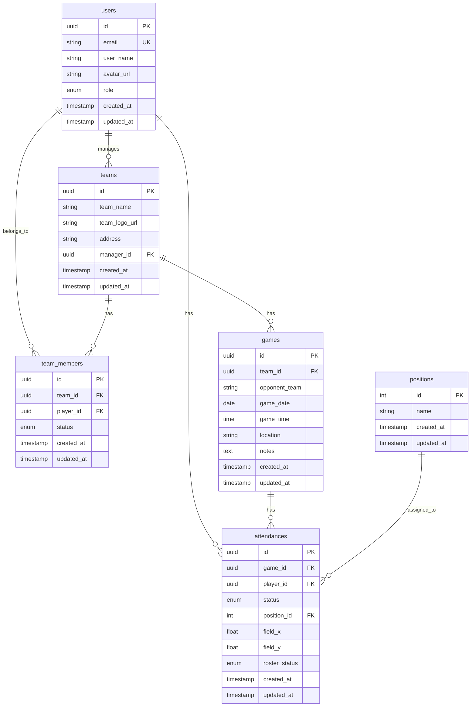
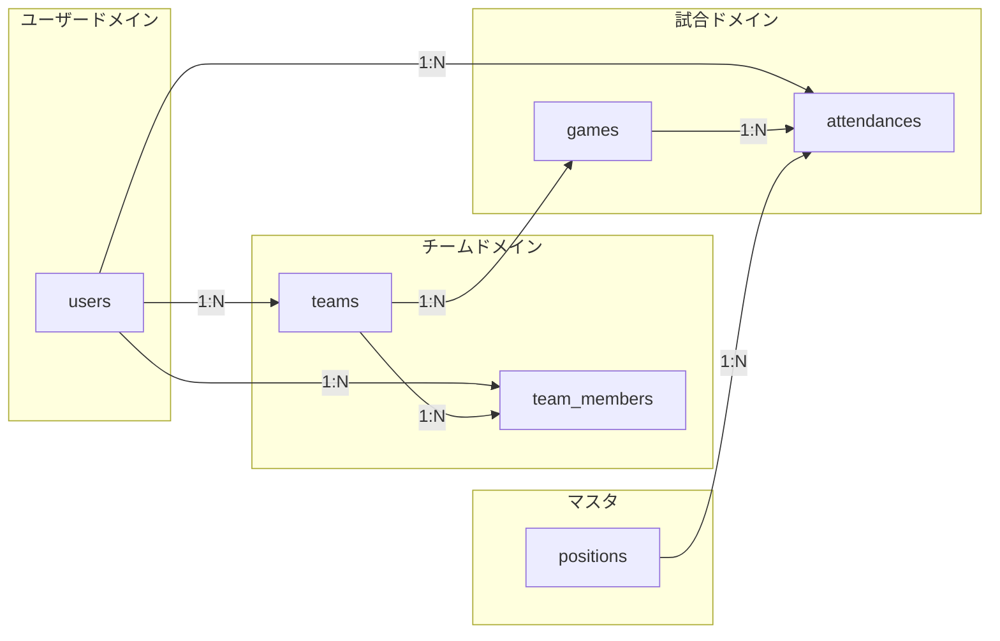
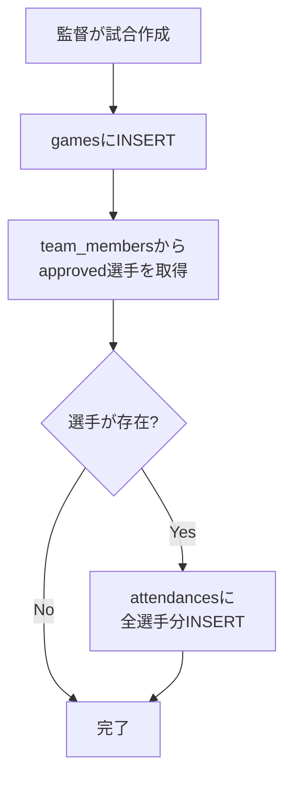
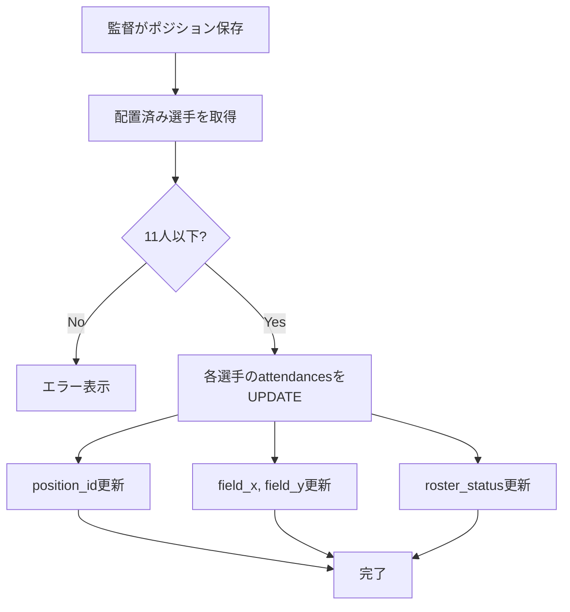

# 3. データベース設計

## 3.1 ER図

## 3.2 テーブル定義

### 3.2.1 users（ユーザー）

ユーザーの基本情報を管理するテーブル。

| カラム名 | データ型 | NULL | デフォルト | 説明 |
|---------|----------|------|-----------|------|
| id | uuid | NO | gen_random_uuid() | 主キー（Supabase Authと連携） |
| email | varchar(255) | NO | - | メールアドレス（一意） |
| user_name | varchar(100) | NO | - | ユーザー表示名 |
| avatar_url | text | YES | NULL | プロフィール画像URL |
| role | varchar(20) | NO | 'player' | ロール（'player' / 'manager'） |
| created_at | timestamptz | NO | now() | 作成日時 |
| updated_at | timestamptz | NO | now() | 更新日時 |

**インデックス:**
- `users_pkey` (id) - 主キー
- `users_email_key` (email) - ユニーク

**制約:**
- `role_check`: role IN ('player', 'manager')

---

### 3.2.2 teams（チーム）

チーム情報を管理するテーブル。

| カラム名 | データ型 | NULL | デフォルト | 説明 |
|---------|----------|------|-----------|------|
| id | uuid | NO | gen_random_uuid() | 主キー |
| team_name | varchar(100) | NO | - | チーム名 |
| team_logo_url | text | YES | NULL | チームロゴ画像URL |
| address | text | YES | NULL | チームの住所・活動場所 |
| manager_id | uuid | NO | - | 監督のユーザーID（外部キー） |
| created_at | timestamptz | NO | now() | 作成日時 |
| updated_at | timestamptz | NO | now() | 更新日時 |

**インデックス:**
- `teams_pkey` (id) - 主キー
- `teams_manager_id_idx` (manager_id) - 監督検索用

**外部キー:**
- `teams_manager_id_fkey`: manager_id → users(id)

---

### 3.2.3 team_members（チームメンバー）

チームと選手の関連を管理する中間テーブル。

| カラム名 | データ型 | NULL | デフォルト | 説明 |
|---------|----------|------|-----------|------|
| id | uuid | NO | gen_random_uuid() | 主キー |
| team_id | uuid | NO | - | チームID（外部キー） |
| player_id | uuid | NO | - | 選手のユーザーID（外部キー） |
| status | varchar(20) | NO | 'pending' | 承認状態 |
| created_at | timestamptz | NO | now() | 作成日時 |
| updated_at | timestamptz | NO | now() | 更新日時 |

**インデックス:**
- `team_members_pkey` (id) - 主キー
- `team_members_team_id_player_id_key` (team_id, player_id) - ユニーク
- `team_members_team_id_idx` (team_id)
- `team_members_player_id_idx` (player_id)

**外部キー:**
- `team_members_team_id_fkey`: team_id → teams(id)
- `team_members_player_id_fkey`: player_id → users(id)

**ステータス値:**
| 値 | 説明 |
|----|------|
| pending | 承認待ち |
| approved | 承認済み（所属中） |
| rejected | 却下 |

---

### 3.2.4 games（試合）

試合スケジュール情報を管理するテーブル。

| カラム名 | データ型 | NULL | デフォルト | 説明 |
|---------|----------|------|-----------|------|
| id | uuid | NO | gen_random_uuid() | 主キー |
| team_id | uuid | NO | - | チームID（外部キー） |
| opponent_team | varchar(100) | NO | - | 対戦相手チーム名 |
| game_date | date | NO | - | 試合日 |
| game_time | time | YES | NULL | 試合時刻 |
| location | text | YES | NULL | 試合会場 |
| notes | text | YES | NULL | 備考 |
| created_at | timestamptz | NO | now() | 作成日時 |
| updated_at | timestamptz | NO | now() | 更新日時 |

**インデックス:**
- `games_pkey` (id) - 主キー
- `games_team_id_idx` (team_id)
- `games_game_date_idx` (game_date) - 日付検索用

**外部キー:**
- `games_team_id_fkey`: team_id → teams(id)

---

### 3.2.5 attendances（出欠）

試合の出欠情報とポジション配置を管理するテーブル。

| カラム名 | データ型 | NULL | デフォルト | 説明 |
|---------|----------|------|-----------|------|
| id | uuid | NO | gen_random_uuid() | 主キー |
| game_id | uuid | NO | - | 試合ID（外部キー） |
| player_id | uuid | NO | - | 選手のユーザーID（外部キー） |
| status | varchar(20) | NO | 'unanswered' | 出欠ステータス |
| position_id | int | YES | NULL | ポジションID（外部キー） |
| field_x | float | YES | NULL | フィールド上のX座標（0-100%） |
| field_y | float | YES | NULL | フィールド上のY座標（0-100%） |
| roster_status | varchar(20) | YES | NULL | 出場状態（starter/sub） |
| created_at | timestamptz | NO | now() | 作成日時 |
| updated_at | timestamptz | NO | now() | 更新日時 |

**インデックス:**
- `attendances_pkey` (id) - 主キー
- `attendances_game_id_player_id_key` (game_id, player_id) - ユニーク
- `attendances_game_id_idx` (game_id)
- `attendances_player_id_idx` (player_id)

**外部キー:**
- `attendances_game_id_fkey`: game_id → games(id)
- `attendances_player_id_fkey`: player_id → users(id)
- `attendances_position_id_fkey`: position_id → positions(id)

**出欠ステータス値:**
| 値 | 説明 |
|----|------|
| unanswered | 未回答 |
| participate | 出席 |
| absent | 欠席 |

**出場状態値:**
| 値 | 説明 |
|----|------|
| starter | スタメン |
| sub | 控え |
| NULL | 未設定 |

---

### 3.2.6 positions（ポジション）

サッカーのポジションマスタテーブル。

| カラム名 | データ型 | NULL | デフォルト | 説明 |
|---------|----------|------|-----------|------|
| id | int | NO | - | 主キー |
| name | varchar(10) | NO | - | ポジション略称 |
| created_at | timestamptz | NO | now() | 作成日時 |
| updated_at | timestamptz | NO | now() | 更新日時 |

**インデックス:**
- `positions_pkey` (id) - 主キー

**マスタデータ:**

| id | name | description |
|----|------|-------------|
| 1 | GK | ゴールキーパー |
| 2 | CB | センターバック |
| 3 | RSB | 右サイドバック |
| 4 | LSB | 左サイドバック |
| 5 | OMF | オフェンシブミッドフィルダー |
| 6 | LMF | 左ミッドフィルダー |
| 7 | RMF | 右ミッドフィルダー |
| 8 | DMF | ディフェンシブミッドフィルダー |
| 9 | CMF | セントラルミッドフィルダー |
| 10 | CF | センターフォワード |
| 11 | ST | ストライカー |
| 12 | LWG | 左ウイング |
| 13 | RWG | 右ウイング |

## 3.3 リレーション図

## 3.4 データフロー

### 試合作成時のデータフロー

### ポジション保存時のデータフロー

## 3.5 Supabase RLS（Row Level Security）設計方針

### usersテーブル
- SELECT: 認証ユーザーは自分のレコードのみ読み取り可能
- UPDATE: 認証ユーザーは自分のレコードのみ更新可能

### teamsテーブル
- SELECT: 全ユーザーが読み取り可能
- INSERT: 監督ロールのみ作成可能
- UPDATE: 監督（manager_id一致）のみ更新可能

### team_membersテーブル
- SELECT: チームメンバーまたは監督が読み取り可能
- INSERT: 選手（加入申請）または監督が作成可能
- UPDATE: 監督のみ更新可能（承認・却下）
- DELETE: 監督のみ削除可能

### gamesテーブル
- SELECT: チームメンバーまたは監督が読み取り可能
- INSERT: 監督のみ作成可能
- UPDATE: 監督のみ更新可能
- DELETE: 監督のみ削除可能

### attendancesテーブル
- SELECT: チームメンバーまたは監督が読み取り可能
- INSERT: 監督のみ作成可能（試合作成時）
- UPDATE: 
  - 選手: 自分のstatusのみ更新可能
  - 監督: position_id, field_x, field_y, roster_statusを更新可能
- DELETE: 監督のみ削除可能
