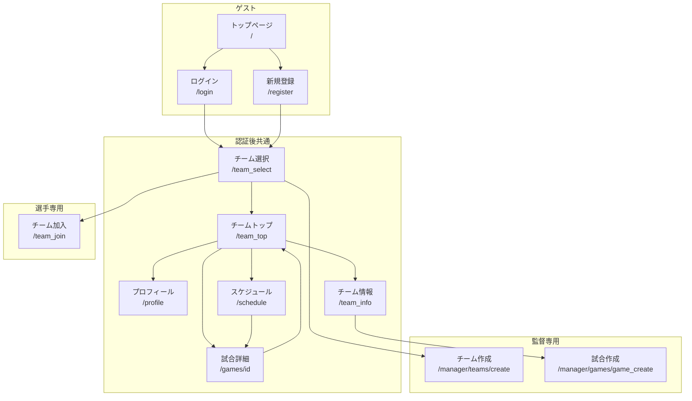
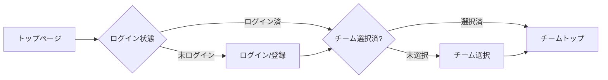

# 4. 画面設計

## 4.1 画面一覧

### 共通画面

| 画面ID | 画面名 | パス | 説明 |
|--------|--------|------|------|
| SCR-001 | トップページ | `/` | サービス紹介・ランディングページ |
| SCR-002 | ログイン | `/login` | ユーザー認証 |
| SCR-003 | 新規登録 | `/register` | ユーザー登録 |
| SCR-004 | プロフィール | `/profile` | ユーザー情報編集 |
| SCR-005 | チーム選択 | `/team_select` | 所属チーム選択 |
| SCR-006 | チームトップ | `/team_top` | チームホーム画面 |
| SCR-007 | スケジュール | `/schedule` | 試合スケジュール一覧 |
| SCR-008 | 試合詳細 | `/games/[id]` | 試合情報・出欠・ポジション |
| SCR-009 | チーム情報 | `/team_info` | チーム詳細情報 |
| SCR-010 | エラー | `/error` | エラー表示 |

### 選手専用画面

| 画面ID | 画面名 | パス | 説明 |
|--------|--------|------|------|
| SCR-P01 | チーム加入申請 | `/team_join` | チーム検索・加入申請 |

### 監督専用画面

| 画面ID | 画面名 | パス | 説明 |
|--------|--------|------|------|
| SCR-M01 | チーム作成 | `/manager/teams/create` | 新規チーム作成・編集 |
| SCR-M02 | 試合作成 | `/manager/games/game_create` | 新規試合登録 |

## 4.2 画面遷移図

### 全体遷移図



### 認証フロー遷移



## 4.3 各画面の詳細設計

### SCR-001: トップページ（`/`）

```
┌─────────────────────────────────────────────────┐
│ [ロゴ] MatchMate        [ログイン] [新規登録] │
├─────────────────────────────────────────────────┤
│                                                 │
│         サッカーチームの                        │
│         出欠管理をもっとスマートに              │
│                                                 │
│              [今すぐ始める]                     │
│                                                 │
├─────────────────────────────────────────────────┤
│  [機能紹介セクション]                          │
│  - 簡単出欠管理                                │
│  - ビジュアルポジション設定                    │
│  - チーム管理                                  │
├─────────────────────────────────────────────────┤
│ フッター                                        │
└─────────────────────────────────────────────────┘
```

**構成要素:**
- ヘッダー（ロゴ、ナビゲーション）
- ヒーローセクション
- 機能紹介
- フッター

---

### SCR-002: ログイン（`/login`）

```
┌─────────────────────────────────────────────────┐
│ [ロゴ] MatchMate                              │
├─────────────────────────────────────────────────┤
│                                                 │
│         ┌─────────────────────────┐            │
│         │      ログイン          │            │
│         │                         │            │
│         │  メールアドレス         │            │
│         │  [________________]     │            │
│         │                         │            │
│         │  パスワード             │            │
│         │  [________________]     │            │
│         │                         │            │
│         │  [    ログイン    ]     │            │
│         │                         │            │
│         │  アカウントをお持ちでない方            │
│         │  [新規登録はこちら]     │            │
│         └─────────────────────────┘            │
│                                                 │
└─────────────────────────────────────────────────┘
```

**入力項目:**
- メールアドレス（必須）
- パスワード（必須）

**アクション:**
- ログインボタン → 認証処理 → チーム選択へ
- 新規登録リンク → 登録画面へ

---

### SCR-003: 新規登録（`/register`）

```
┌─────────────────────────────────────────────────┐
│ [ロゴ] MatchMate                              │
├─────────────────────────────────────────────────┤
│                                                 │
│         ┌─────────────────────────┐            │
│         │     新規登録           │            │
│         │                         │            │
│         │  ユーザー名             │            │
│         │  [________________]     │            │
│         │                         │            │
│         │  メールアドレス         │            │
│         │  [________________]     │            │
│         │                         │            │
│         │  パスワード             │            │
│         │  [________________]     │            │
│         │                         │            │
│         │  ロール選択             │            │
│         │  ○ 選手  ○ 監督        │            │
│         │                         │            │
│         │  [    登録する    ]     │            │
│         └─────────────────────────┘            │
│                                                 │
└─────────────────────────────────────────────────┘
```

**入力項目:**
- ユーザー名（必須）
- メールアドレス（必須）
- パスワード（必須、6文字以上）
- ロール選択（選手/監督）

---

### SCR-005: チーム選択（`/team_select`）

```
┌─────────────────────────────────────────────────┐
│ [ロゴ] MatchMate                 [ログアウト] │
├─────────────────────────────────────────────────┤
│                                                 │
│  チームを選択してください                       │
│                                                 │
│  ┌──────────────────┐  ┌──────────────────┐    │
│  │ [ロゴ]           │  │ [ロゴ]           │    │
│  │ チームA          │  │ チームB          │    │
│  │ [選択]           │  │ [選択]           │    │
│  └──────────────────┘  └──────────────────┘    │
│                                                 │
│  ─────────────────────────────────────────      │
│                                                 │
│  [選手] 新しいチームに加入する                 │
│  [監督] 新しいチームを作成する                 │
│                                                 │
└─────────────────────────────────────────────────┘
```

**表示内容:**
- 所属チーム一覧（カード形式）
  - 承認済み: 選択可能
  - 申請中: 「承認待ち」表示
  - 却下: 「再申請」ボタン
- 新規加入/作成リンク

---

### SCR-006: チームトップ（`/team_top`）

```
┌─────────────────────────────────────────────────┐
│ [ロゴ] MatchMate   [スケジュール][プロフィール]│
│                    [チーム管理][ログアウト]    │
├─────────────────────────────────────────────────┤
│                                                 │
│  ようこそ、[ユーザー名]さん                    │
│                                                 │
│  ━━━ 直近の試合 ━━━━━━━━━━━━━━━━━━━━━━━━━     │
│                                                 │
│  ┌─────────────────────────────────────────┐   │
│  │ 2024/12/15 (日) 14:00                   │   │
│  │ vs. ライバルFC                          │   │
│  │ ○出席: 8  ×欠席: 2  △未定: 3           │   │
│  │                              [詳細を見る]│   │
│  └─────────────────────────────────────────┘   │
│                                                 │
│  [監督のみ] [+ 試合を追加]                     │
│                                                 │
└─────────────────────────────────────────────────┘
```

**表示内容:**
- ユーザー挨拶
- 直近の試合一覧（出欠サマリー付き）
- 試合追加ボタン（監督のみ）

---

### SCR-008: 試合詳細（`/games/[id]`）

```
┌─────────────────────────────────────────────────┐
│ [← チームトップに戻る]                         │
├─────────────────────────────────────────────────┤
│                                                 │
│  試合詳細                        [編集] (監督)  │
│                                                 │
│  対戦相手: ライバルFC                          │
│  試合日: 2024年12月15日（日）                  │
│  時間: 午後2時00分                             │
│  場所: 中央グラウンド                          │
│                                                 │
├─────────────────────────────────────────────────┤
│  出欠回答 (選手のみ)                           │
│  [ 出席 ] [ 欠席 ] [ 未定 ]                    │
├─────────────────────────────────────────────────┤
│  ポジション設定 (監督のみ)                     │
│                     [ポジションを設定]          │
│  ┌────────────────────────┬──────────────┐     │
│  │   ⚽ サッカーフィールド  │  未配置選手  │     │
│  │                         │  ・選手A     │     │
│  │    [GK]                 │  ・選手B     │     │
│  │   [CB] [CB]             │              │     │
│  │  [LB]     [RB]          │  控え選手    │     │
│  │   [MF] [MF]             │  ・選手C     │     │
│  │  [LW]  [CF]  [RW]       │              │     │
│  └────────────────────────┴──────────────┘     │
├─────────────────────────────────────────────────┤
│  チーム内の出欠状況                             │
│  ┌───────────────────────────────────────┐     │
│  │ [画像] 選手A            [出席]        │     │
│  │ [画像] 選手B            [欠席]        │     │
│  │ [画像] 選手C            [未回答]      │     │
│  └───────────────────────────────────────┘     │
│                                                 │
└─────────────────────────────────────────────────┘
```

**構成要素:**
1. **試合情報セクション**
   - 対戦相手、日時、場所、備考
   - 編集ボタン（監督のみ）

2. **出欠回答セクション**（選手のみ）
   - 出席/欠席/未定ボタン

3. **ポジション設定セクション**（監督のみ）
   - フォーメーション選択
   - サッカーフィールド（ドラッグ&ドロップ）
   - 未配置選手リスト
   - 控え選手リスト

4. **出欠状況セクション**
   - チームメンバーの出欠一覧

---

### SCR-M02: 試合作成（`/manager/games/game_create`）

```
┌─────────────────────────────────────────────────┐
│ [← 戻る]                                        │
├─────────────────────────────────────────────────┤
│                                                 │
│  新しい試合を登録                              │
│                                                 │
│  対戦相手 *                                    │
│  [________________________]                     │
│                                                 │
│  試合日 *                                      │
│  [____/____/____]                              │
│                                                 │
│  試合時間 *                                    │
│  [____:____]                                    │
│                                                 │
│  場所                                          │
│  [________________________]                     │
│                                                 │
│  備考                                          │
│  [________________________]                     │
│  [________________________]                     │
│                                                 │
│  [      試合を登録      ]                      │
│                                                 │
└─────────────────────────────────────────────────┘
```

**入力項目:**
- 対戦相手（必須）
- 試合日（必須）
- 試合時間（必須）
- 場所（任意）
- 備考（任意）

## 4.4 レスポンシブ対応

### ブレークポイント

| ブレークポイント | 画面幅 | 対象デバイス |
|-----------------|--------|--------------|
| sm | 640px以上 | スマートフォン（横向き） |
| md | 768px以上 | タブレット |
| lg | 1024px以上 | ノートPC |
| xl | 1280px以上 | デスクトップ |

### レイアウト変更

**ポジション設定画面:**
- **デスクトップ（lg以上）**: フィールドと選手リストを横並び（2:1）
- **タブレット・スマホ（lg未満）**: フィールドと選手リストを縦並び

**ナビゲーション:**
- **デスクトップ**: 横並びメニュー
- **スマホ**: ハンバーガーメニュー

## 4.5 共通UIコンポーネント

### ヘッダー

```
┌─────────────────────────────────────────────────┐
│ [ロゴ] MatchMate   [メニュー1][メニュー2][...] │
└─────────────────────────────────────────────────┘
```

**状態別表示:**
- 未ログイン: ログイン、新規登録
- ログイン後（選手）: スケジュール、プロフィール、ログアウト
- ログイン後（監督）: スケジュール、プロフィール、チーム管理、ログアウト

### フッター

```
┌─────────────────────────────────────────────────┐
│ [ロゴ] MatchMate                               │
│                                                 │
│ サービス    │ サポート                          │
│ - 機能紹介  │ - ヘルプ                         │
│ - 料金      │ - お問い合わせ                    │
│             │ - 利用規約                        │
│                                                 │
│ © 2024 MatchMate. All rights reserved.         │
└─────────────────────────────────────────────────┘
```

### ボタンスタイル

| タイプ | 用途 | スタイル |
|--------|------|----------|
| Primary | 主要アクション | 緑背景、白文字 |
| Secondary | 副次アクション | グレー背景 |
| Danger | 削除、却下 | 赤背景、白文字 |
| Ghost | キャンセル | 枠線のみ |

### ステータスバッジ

| ステータス | 色 |
|-----------|------|
| 出席 | 緑 |
| 欠席 | 赤 |
| 未回答 | 黄色 |
| 承認待ち | 黄色 |
| 承認済み | 緑 |
| 却下 | 赤 |
