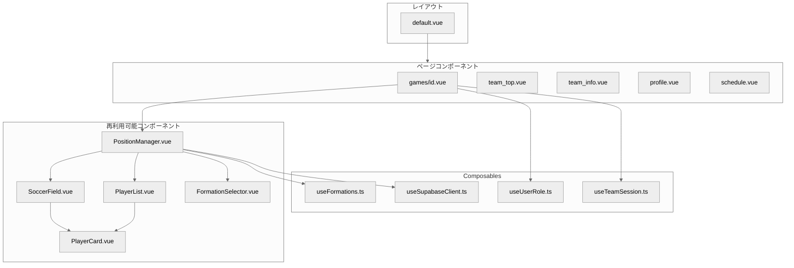
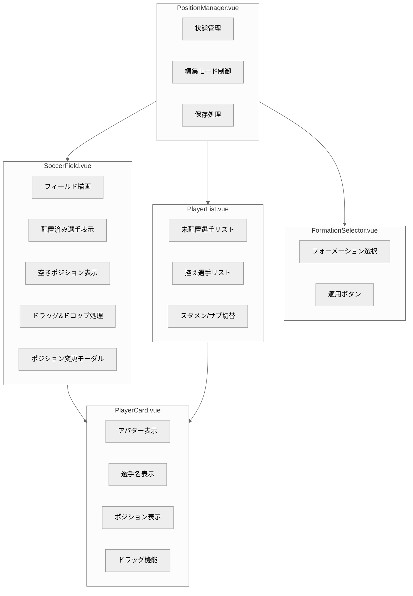
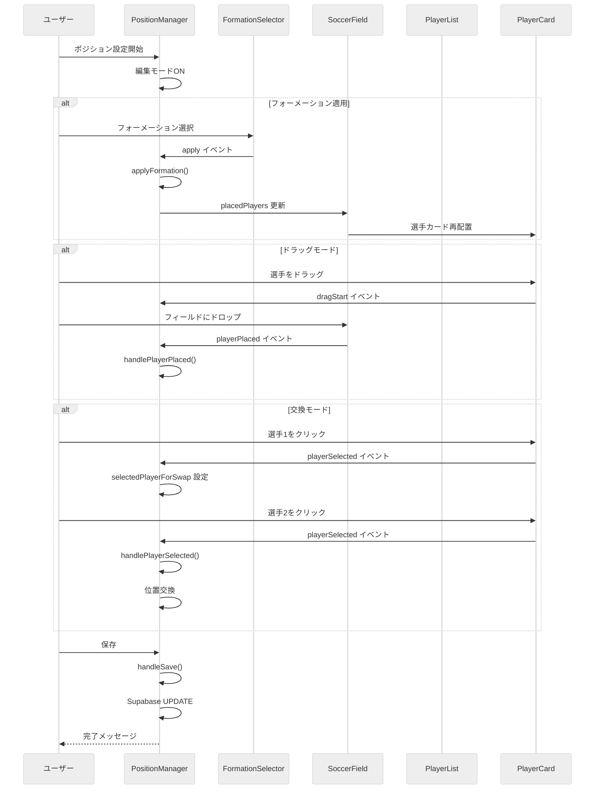
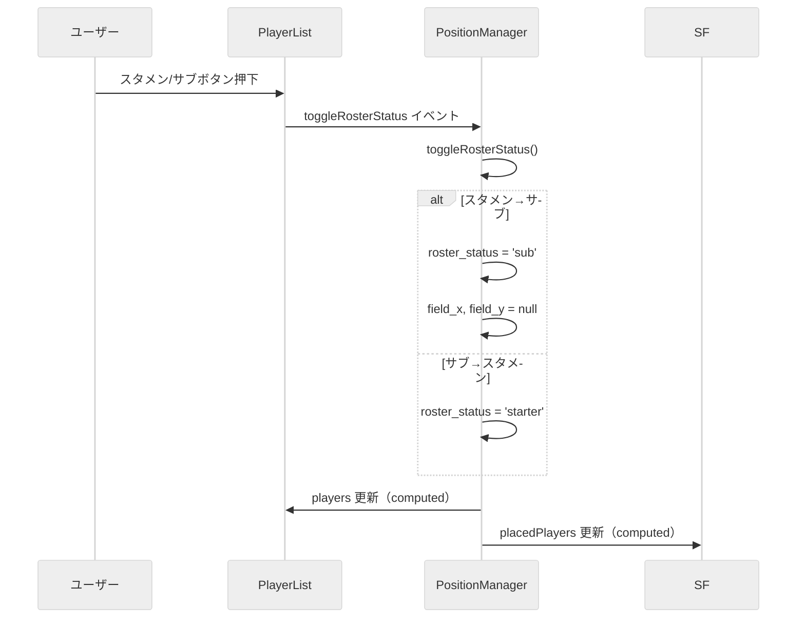

# 5. コンポーネント設計

## 5.1 コンポーネント構成図

### 全体構成



### ポジション設定機能のコンポーネント構成



## 5.2 コンポーネント詳細設計

### 5.2.1 PositionManager.vue

**責務:**
- ポジション設定機能全体の統合管理
- フォーメーション選択、フィールド表示、選手リストの連携
- 編集モードの制御
- データベースへの保存処理

**Props:**

| プロパティ名 | 型 | 必須 | デフォルト | 説明 |
|-------------|-----|------|-----------|------|
| gameId | string | Yes | - | 試合ID |
| players | Player[] | Yes | - | 出席選手リスト |
| availablePositions | Position[] | No | [] | ポジションマスタ |

**Emits:**

| イベント名 | ペイロード | 説明 |
|-----------|-----------|------|
| close | - | 編集終了 |
| saved | - | 保存完了 |
| edit-mode-changed | boolean | 編集モード変更 |

**内部状態:**

```typescript
interface Player {
  player_id: string
  user_name: string
  avatar_url?: string
  position_id?: number | null
  position_name?: string | null
  field_x?: number | null
  field_y?: number | null
  roster_status: 'starter' | 'sub' | null
  status: string
}

// 状態
const isEditMode = ref(false)
const selectedFormation = ref('4-4-2')
const playerPositions = ref<Map<string, Player>>(new Map())
const isSaving = ref(false)
const error = ref<string | null>(null)
const editMode = ref<'drag' | 'swap'>('swap')
const selectedPlayerForSwap = ref<string | null>(null)
```

**算出プロパティ:**

| プロパティ名 | 説明 |
|-------------|------|
| placedPlayers | フィールドに配置済みの選手 |
| unplacedPlayers | スタメンだが未配置の選手 |
| substitutePlayers | 控え選手 |
| emptyPositions | 空きフォーメーション位置 |

**主要メソッド:**

| メソッド名 | 説明 |
|-----------|------|
| applyFormation() | フォーメーションを適用 |
| handlePlayerPlaced() | 選手をフィールドに配置 |
| handlePlayerSelected() | 選手を選択（交換モード） |
| handlePositionSwap() | 2選手の位置を交換 |
| toggleRosterStatus() | スタメン/サブ切替 |
| handleSave() | ポジション情報を保存 |
| startEdit() | 編集モード開始 |
| cancelEdit() | 編集モードキャンセル |

---

### 5.2.2 SoccerField.vue

**責務:**
- サッカーフィールドの描画
- 配置済み選手の表示
- ドラッグ&ドロップ処理
- ポジション変更モーダル

**Props:**

| プロパティ名 | 型 | 必須 | デフォルト | 説明 |
|-------------|-----|------|-----------|------|
| placedPlayers | PlayerOnField[] | Yes | - | 配置済み選手 |
| emptyPositions | EmptyPosition[] | No | [] | 空きポジション |
| editable | boolean | No | true | 編集可能フラグ |
| editMode | 'drag' \| 'swap' | No | 'drag' | 編集モード |
| selectedPlayerId | string \| null | No | null | 選択中の選手ID |
| selectedPlayerIdForPositionEdit | string \| null | No | null | ポジション編集中の選手ID |

**Emits:**

| イベント名 | ペイロード | 説明 |
|-----------|-----------|------|
| playerPlaced | (playerId, x, y) | 選手配置 |
| playerDragStart | playerId | ドラッグ開始 |
| playerSelected | playerId | 選手選択 |
| positionSwap | (draggedId, targetId) | 位置交換 |
| positionChange | (playerId, newPosition) | ポジション変更 |
| positionEditRequest | playerId | ポジション編集リクエスト |
| closePositionModal | - | モーダルを閉じる |

**フィールドレイアウト:**

```
┌─────────────────────────────────┐
│           ゴール                 │
│  ┌─────────────────────────┐    │  ← ペナルティエリア
│  └─────────────────────────┘    │
│                                 │
│                                 │
│              ○                  │  ← センターサークル
│  ─────────────────────────────  │  ← センターライン
│              ○                  │
│                                 │
│                                 │
│  ┌─────────────────────────┐    │  ← ペナルティエリア
│  └─────────────────────────┘    │
│           ゴール                 │
└─────────────────────────────────┘
```

**座標システム:**
- X座標: 0-100%（左端=0, 右端=100）
- Y座標: 0-100%（上端=0, 下端=100）
- GKは y=93（下端付近）

---

### 5.2.3 PlayerCard.vue

**責務:**
- 選手情報の表示（アバター、名前、ポジション）
- ドラッグ可能な状態の管理
- スタメン/サブ状態の視覚表示

**Props:**

| プロパティ名 | 型 | 必須 | デフォルト | 説明 |
|-------------|-----|------|-----------|------|
| player | Player | Yes | - | 選手情報 |
| positionName | string \| null | No | - | ポジション名 |
| rosterStatus | 'starter' \| 'sub' \| null | No | - | 出場状態 |
| draggable | boolean | No | true | ドラッグ可能フラグ |
| showRosterStatus | boolean | No | true | 出場状態表示フラグ |
| allowPositionEdit | boolean | No | false | ポジション編集許可 |
| availablePositions | string[] | No | [...] | 選択可能ポジション |
| size | 'small' \| 'medium' \| 'large' | No | 'medium' | サイズ |

**Emits:**

| イベント名 | ペイロード | 説明 |
|-----------|-----------|------|
| dragStart | playerId | ドラッグ開始 |
| dragEnd | - | ドラッグ終了 |
| positionChange | (playerId, newPosition) | ポジション変更 |
| positionEditRequest | playerId | ポジション編集リクエスト |

**視覚的状態:**

| 状態 | スタイル |
|------|----------|
| スタメン | 緑色のボーダー |
| 控え | グレーのボーダー |
| ドラッグ中 | 半透明、縮小 |
| 選択中 | 黄色のリング、拡大 |

---

### 5.2.4 FormationSelector.vue

**責務:**
- フォーメーションの選択UI
- 適用ボタンの提供

**Props:**

| プロパティ名 | 型 | 必須 | デフォルト | 説明 |
|-------------|-----|------|-----------|------|
| modelValue | string | Yes | - | 選択中のフォーメーション |
| editable | boolean | No | true | 編集可能フラグ |

**Emits:**

| イベント名 | ペイロード | 説明 |
|-----------|-----------|------|
| update:modelValue | string | フォーメーション変更 |
| apply | formationName | フォーメーション適用 |

**選択可能フォーメーション:**
- 4-4-2
- 4-3-3
- 3-5-2
- 4-2-3-1
- 3-4-3

---

### 5.2.5 PlayerList.vue

**責務:**
- 未配置選手・控え選手の一覧表示
- スタメン/サブ切替機能
- 選手選択機能（交換モード用）

**Props:**

| プロパティ名 | 型 | 必須 | デフォルト | 説明 |
|-------------|-----|------|-----------|------|
| players | Player[] | Yes | - | 選手リスト |
| title | string | No | '控え選手' | リストタイトル |
| editable | boolean | No | true | 編集可能フラグ |
| emptyMessage | string | No | '...' | 空時のメッセージ |
| editMode | 'drag' \| 'swap' | No | 'swap' | 編集モード |
| selectedPlayerId | string \| null | No | null | 選択中の選手ID |

**Emits:**

| イベント名 | ペイロード | 説明 |
|-----------|-----------|------|
| toggleRosterStatus | playerId | スタメン/サブ切替 |
| playerSelected | playerId | 選手選択 |

## 5.3 Composables設計

### 5.3.1 useFormations.ts

**責務:**
- フォーメーション定義の管理
- フォーメーション取得機能

**インターフェース:**

```typescript
interface FormationPosition {
  position_id: number  // positionsテーブルのID
  x: number            // 0-100%
  y: number            // 0-100%
}

interface Formation {
  name: string
  displayName: string
  positions: FormationPosition[]
}
```

**提供機能:**

| 関数名 | 戻り値 | 説明 |
|--------|--------|------|
| getFormation(name) | Formation \| null | 指定フォーメーション取得 |
| getFormationList() | Formation[] | 全フォーメーション一覧取得 |

**フォーメーション定義例（4-4-2）:**

```typescript
'4-4-2': {
  name: '4-4-2',
  displayName: '4-4-2',
  positions: [
    { position_id: 1, x: 50, y: 93 },  // GK
    { position_id: 4, x: 15, y: 72 },  // LSB
    { position_id: 2, x: 38, y: 77 },  // CB
    { position_id: 2, x: 62, y: 77 },  // CB
    { position_id: 3, x: 85, y: 72 },  // RSB
    { position_id: 6, x: 15, y: 50 },  // LMF
    { position_id: 9, x: 38, y: 50 },  // CMF
    { position_id: 9, x: 62, y: 50 },  // CMF
    { position_id: 7, x: 85, y: 50 },  // RMF
    { position_id: 10, x: 38, y: 23 }, // CF
    { position_id: 10, x: 62, y: 23 }, // CF
  ]
}
```

---

### 5.3.2 useUserRole.ts

**責務:**
- ユーザーロール情報の取得・キャッシュ
- ロールに基づく権限判定
- ログアウト処理

**提供機能:**

| 名前 | 型 | 説明 |
|------|-----|------|
| userData | Ref\<UserData\> | ユーザー情報（readonly） |
| role | ComputedRef\<UserRole\> | 現在のロール |
| isPlayer | ComputedRef\<boolean\> | 選手かどうか |
| isManager | ComputedRef\<boolean\> | 監督かどうか |
| isLoggedIn | ComputedRef\<boolean\> | ログイン状態 |
| loading | Ref\<boolean\> | 読み込み中フラグ |
| error | Ref\<string\> | エラーメッセージ |
| fetchUserRole() | Promise\<UserRole\> | ロール取得 |
| clearCache() | void | キャッシュクリア |
| logout() | Promise\<void\> | ログアウト |

---

### 5.3.3 useTeamSession.ts

**責務:**
- チームセッション管理
- チームID の取得・設定

**提供機能:**

| 名前 | 型 | 説明 |
|------|-----|------|
| sessionTeamId | Ref\<string\> | 現在のチームID |
| getTeamId() | Promise\<string\> | チームID取得 |
| setTeamId(teamId) | Promise\<boolean\> | チームID設定 |
| clearTeamId() | void | チームIDクリア |

**保存先:**
- Supabase Auth の user_metadata に保存
- `user.user_metadata.data.teamId`

---

### 5.3.4 useSupabaseClient.ts

**責務:**
- Supabaseクライアントのシングルトン管理
- 複数インスタンス生成の防止

**提供機能:**

```typescript
export const useSupabaseClient = () => {
  // シングルトンインスタンスを返す
  return supabaseInstance
}
```

## 5.4 コンポーネント間のデータフロー

### ポジション設定時のデータフロー



### スタメン/サブ切替のデータフロー


