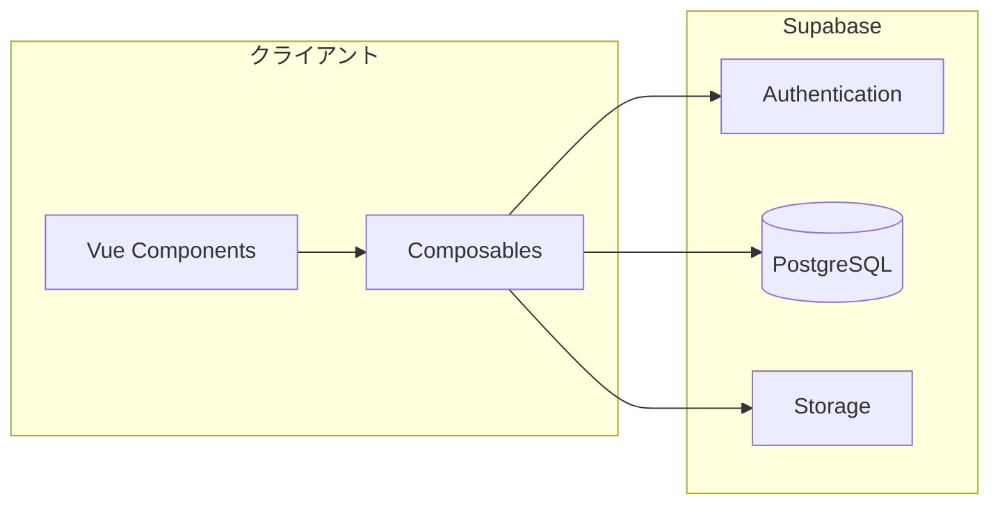
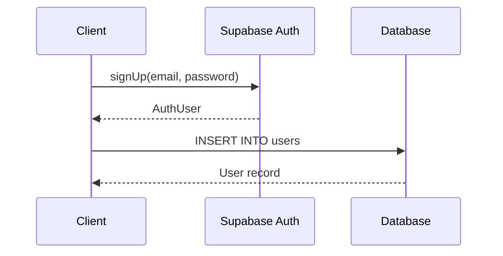
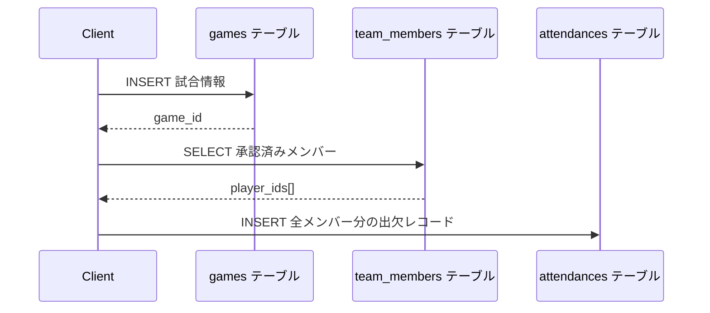
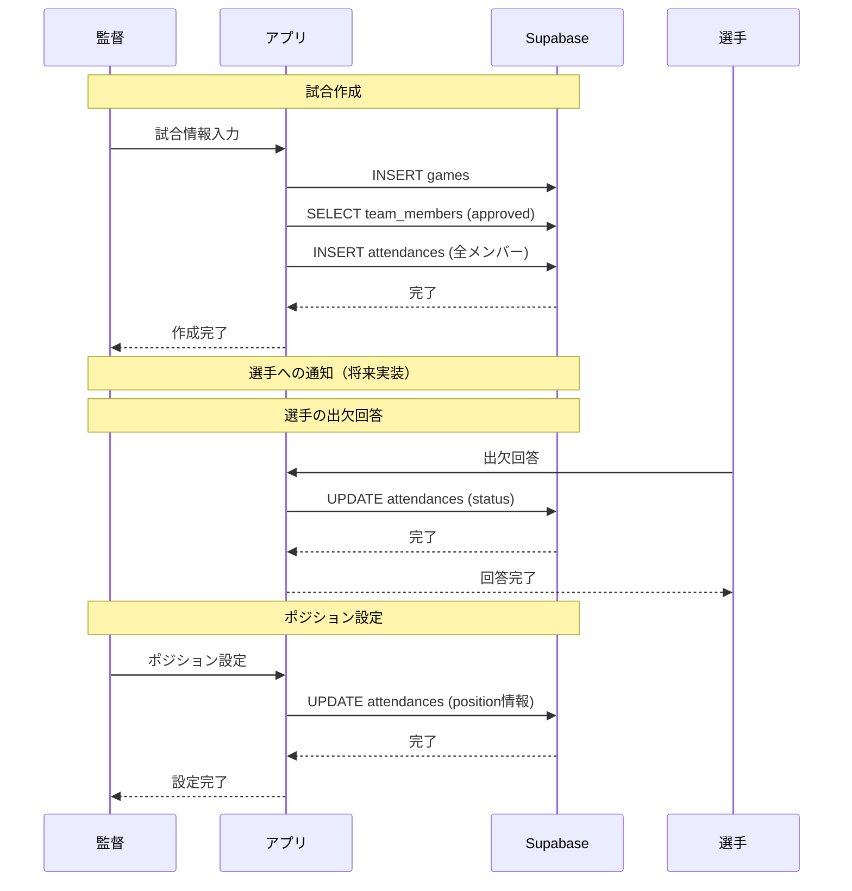
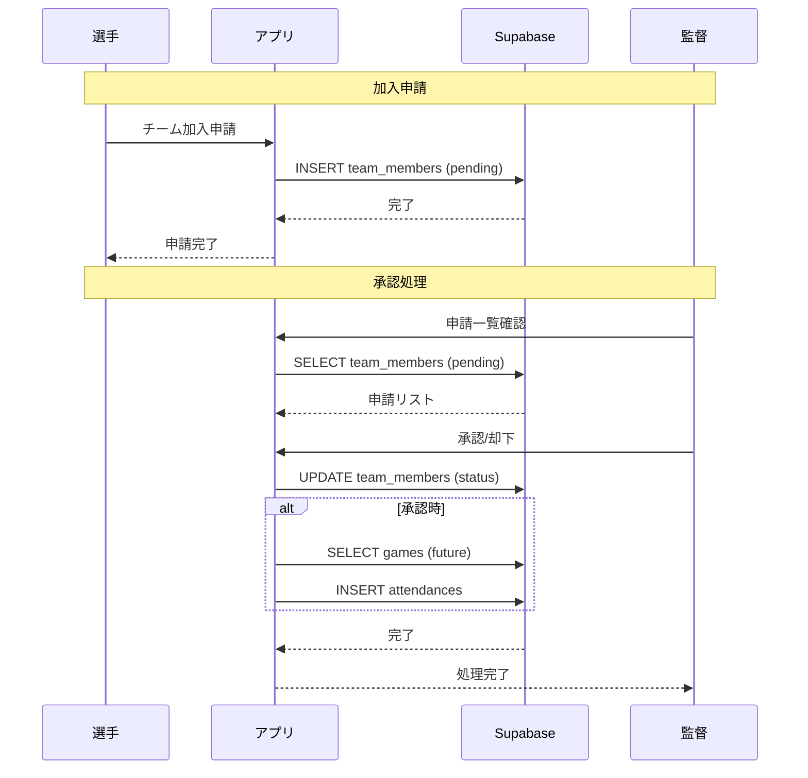

# 6. API設計

## 6.1 API設計概要

MatchMateはSupabaseをBaaSとして使用しているため、従来のREST APIではなく、Supabaseクライアントライブラリを通じたデータアクセスを行います。

### アクセスパターン



## 6.2 認証API

### 6.2.1 ユーザー登録

**処理フロー:**



**コード例:**

```typescript
// 1. Supabase Authでユーザー作成
const { data: authData, error: authError } = await supabase.auth.signUp({
  email: email,
  password: password,
})

// 2. usersテーブルにユーザー情報を登録
const { data: insertData, error: insertError } = await supabase
  .from('users')
  .upsert({
    id: authData.user.id,
    email: email,
    user_name: userName,
    role: role,
  })
```

### 6.2.2 ログイン

**コード例:**

```typescript
const { data, error } = await supabase.auth.signInWithPassword({
  email: email,
  password: password,
})
```

### 6.2.3 ログアウト

**コード例:**

```typescript
const { error } = await supabase.auth.signOut()
```

### 6.2.4 現在のユーザー取得

**コード例:**

```typescript
const { data: { user } } = await supabase.auth.getUser()
```

## 6.3 ユーザー管理API

### 6.3.1 ユーザー情報取得

**テーブル:** users

**クエリ:**

```typescript
const { data, error } = await supabase
  .from('users')
  .select('id, user_name, email, avatar_url, role')
  .eq('id', userId)
  .single()
```

**レスポンス:**

```typescript
interface User {
  id: string
  user_name: string
  email: string
  avatar_url: string | null
  role: 'player' | 'manager'
}
```

### 6.3.2 ユーザー情報更新

**クエリ:**

```typescript
const { error } = await supabase
  .from('users')
  .update({
    user_name: userName,
    avatar_url: avatarUrl,
    updated_at: new Date().toISOString()
  })
  .eq('id', userId)
```

## 6.4 チーム管理API

### 6.4.1 チーム作成

**テーブル:** teams

**クエリ:**

```typescript
const { data, error } = await supabase
  .from('teams')
  .insert({
    team_name: teamName,
    team_logo_url: logoUrl,
    address: address,
    manager_id: managerId,
  })
  .select('id')
  .single()
```

### 6.4.2 チーム情報取得

**クエリ:**

```typescript
const { data, error } = await supabase
  .from('teams')
  .select('*')
  .eq('id', teamId)
  .single()
```

**レスポンス:**

```typescript
interface Team {
  id: string
  team_name: string
  team_logo_url: string | null
  address: string | null
  manager_id: string
  created_at: string
  updated_at: string
}
```

### 6.4.3 監督のチーム一覧取得

**クエリ:**

```typescript
const { data, error } = await supabase
  .from('teams')
  .select()
  .eq('manager_id', managerId)
```

### 6.4.4 チーム更新

**クエリ:**

```typescript
const { error } = await supabase
  .from('teams')
  .update({
    team_name: teamName,
    team_logo_url: logoUrl,
    address: address,
    updated_at: new Date().toISOString()
  })
  .eq('id', teamId)
```

## 6.5 チームメンバー管理API

### 6.5.1 加入申請

**テーブル:** team_members

**クエリ:**

```typescript
const { error } = await supabase
  .from('team_members')
  .insert({
    team_id: teamId,
    player_id: playerId,
    status: 'pending',
  })
```

### 6.5.2 選手の所属チーム一覧取得

**クエリ（JOINあり）:**

```typescript
const { data, error } = await supabase
  .from('team_members')
  .select(`
    team_id,
    status,
    teams!inner(id, team_name, team_logo_url)
  `)
  .eq('player_id', playerId)
```

### 6.5.3 チームメンバー一覧取得

**クエリ:**

```typescript
// 承認済みメンバー取得
const { data: teamMembers, error } = await supabase
  .from('team_members')
  .select('player_id')
  .eq('team_id', teamId)
  .eq('status', 'approved')

// ユーザー情報を取得
const playerIds = teamMembers.map(m => m.player_id)
const { data: players, error } = await supabase
  .from('users')
  .select('id, user_name, avatar_url')
  .in('id', playerIds)
```

### 6.5.4 加入申請の承認/却下

**クエリ:**

```typescript
const { error } = await supabase
  .from('team_members')
  .update({ 
    status: status,  // 'approved' or 'rejected'
    updated_at: new Date().toISOString() 
  })
  .eq('team_id', teamId)
  .eq('player_id', playerId)
```

### 6.5.5 メンバー除名

**クエリ:**

```typescript
// 1. ステータスをrejectedに更新
const { error: updateError } = await supabase
  .from('team_members')
  .update({ status: 'rejected', updated_at: new Date().toISOString() })
  .eq('team_id', teamId)
  .eq('player_id', playerId)

// 2. 未来の試合のattendanceを削除
const { error: deleteError } = await supabase
  .from('attendances')
  .delete()
  .eq('player_id', playerId)
  .in('game_id', futureGameIds)
```

## 6.6 試合管理API

### 6.6.1 試合作成

**テーブル:** games, attendances

**処理フロー:**



**クエリ:**

```typescript
// 1. 試合作成
const { data: insertedGame, error: gameError } = await supabase
  .from('games')
  .insert([{
    team_id: teamId,
    opponent_team: opponentTeam,
    game_date: gameDate,
    game_time: gameTime,
    location: location,
    notes: notes,
  }])
  .select('id')
  .single()

// 2. チームメンバー取得
const { data: playersData, error: playersError } = await supabase
  .from('team_members')
  .select('player_id')
  .eq('team_id', teamId)
  .eq('status', 'approved')

// 3. 出欠レコード作成
const attendanceInserts = playersData.map(player => ({
  game_id: insertedGame.id,
  player_id: player.player_id,
  status: 'unanswered',
}))

const { error: attendanceError } = await supabase
  .from('attendances')
  .insert(attendanceInserts)
```

### 6.6.2 試合情報取得

**クエリ:**

```typescript
const { data, error } = await supabase
  .from('games')
  .select('*')
  .eq('id', gameId)
  .single()
```

**レスポンス:**

```typescript
interface Game {
  id: string
  team_id: string
  opponent_team: string
  game_date: string
  game_time: string | null
  location: string | null
  notes: string | null
  created_at: string
  updated_at: string
}
```

### 6.6.3 試合一覧取得（出欠サマリー付き）

**クエリ:**

```typescript
const { data, error } = await supabase
  .from('games')
  .select('*, attendances(status)')
  .eq('team_id', teamId)
  .gte('game_date', today)
  .order('game_date', { ascending: true })
```

### 6.6.4 試合更新

**クエリ:**

```typescript
const { error } = await supabase
  .from('games')
  .update({
    opponent_team: opponentTeam,
    game_date: gameDate,
    game_time: gameTime,
    location: location,
    notes: notes,
    updated_at: new Date().toISOString()
  })
  .eq('id', gameId)
```

### 6.6.5 試合削除

**クエリ:**

```typescript
// 1. 関連する出欠を削除
const { error: deleteAttendanceError } = await supabase
  .from('attendances')
  .delete()
  .eq('game_id', gameId)

// 2. 試合を削除
const { error: deleteMatchError } = await supabase
  .from('games')
  .delete()
  .eq('id', gameId)
```

## 6.7 出欠管理API

### 6.7.1 出欠情報取得（監督用）

**クエリ（ポジション情報含む）:**

```typescript
const { data, error } = await supabase
  .from('attendances')
  .select(`
    player_id,
    status,
    position_id,
    field_x,
    field_y,
    roster_status,
    users!left(id, user_name, avatar_url),
    positions!left(id, name)
  `)
  .eq('game_id', gameId)
  .in('player_id', memberIds)
```

**レスポンス:**

```typescript
interface AttendanceWithDetails {
  player_id: string
  status: 'unanswered' | 'participate' | 'absent'
  position_id: number | null
  field_x: number | null
  field_y: number | null
  roster_status: 'starter' | 'sub' | null
  users: {
    id: string
    user_name: string
    avatar_url: string | null
  }
  positions: {
    id: number
    name: string
  } | null
}
```

### 6.7.2 出欠回答（選手用）

**クエリ:**

```typescript
const { error } = await supabase
  .from('attendances')
  .update({ status: status })  // 'participate', 'absent', 'unanswered'
  .eq('game_id', gameId)
  .eq('player_id', playerId)
```

### 6.7.3 ポジション情報更新（監督用）

**クエリ:**

```typescript
const { error } = await supabase
  .from('attendances')
  .update({
    position_id: positionId,
    field_x: fieldX,
    field_y: fieldY,
    roster_status: rosterStatus  // 'starter' or 'sub'
  })
  .eq('game_id', gameId)
  .eq('player_id', playerId)
```

## 6.8 ポジションマスタAPI

### 6.8.1 ポジション一覧取得

**テーブル:** positions

**クエリ:**

```typescript
const { data, error } = await supabase
  .from('positions')
  .select('*')
```

**レスポンス:**

```typescript
interface Position {
  id: number
  name: string
  description: string | null
  created_at: string
}
```

## 6.9 エラーハンドリング

### エラーレスポンス形式

Supabaseのエラーは以下の形式で返されます：

```typescript
interface PostgrestError {
  message: string
  details: string
  hint: string
  code: string
}
```

### 共通エラーコード

| コード | 説明 | 対処法 |
|--------|------|--------|
| 23505 | 一意制約違反 | 既存データの重複 |
| 23503 | 外部キー制約違反 | 参照先が存在しない |
| 42501 | RLS違反 | 権限不足 |
| PGRST116 | レコードが見つからない | 該当データなし |

### エラーハンドリング例

```typescript
const { data, error } = await supabase
  .from('games')
  .select('*')
  .eq('id', gameId)
  .single()

if (error) {
  if (error.code === 'PGRST116') {
    // レコードが見つからない
    errorMessage.value = '試合が見つかりませんでした'
  } else if (error.code === '42501') {
    // 権限エラー
    errorMessage.value = 'この操作を行う権限がありません'
  } else {
    // その他のエラー
    console.error('Error:', error)
    errorMessage.value = 'エラーが発生しました'
  }
  return
}
```

## 6.10 データ操作フロー図

### 試合作成から出欠回答までのフロー



### チーム加入から承認までのフロー


