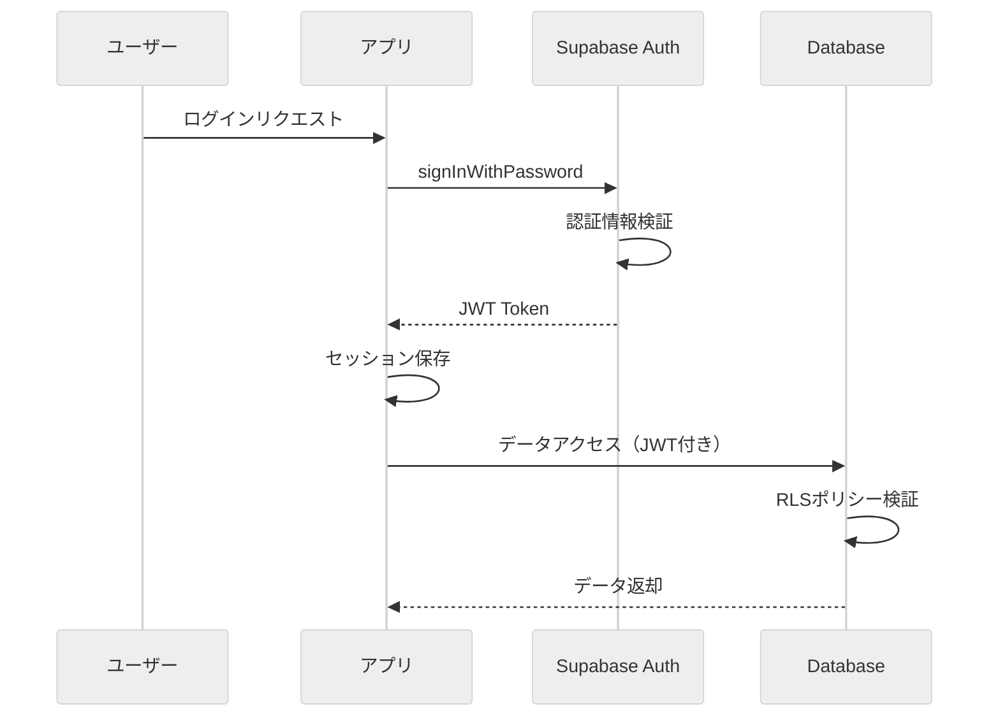
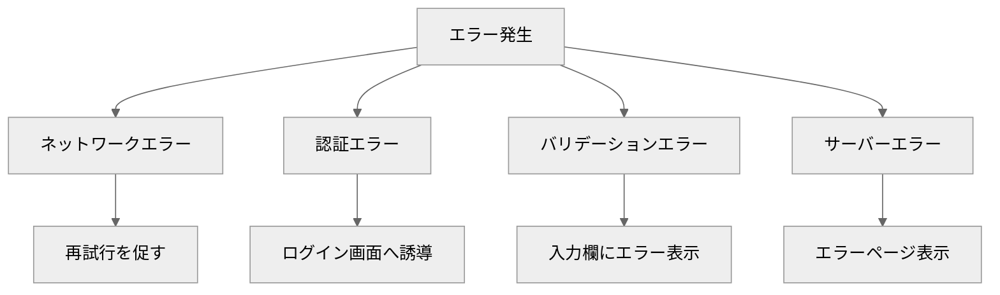
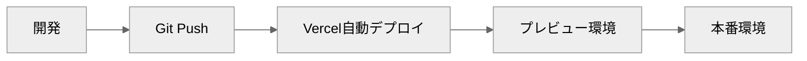

# 7. 非機能要件

## 7.1 パフォーマンス要件

### 7.1.1 レスポンス時間

| 操作 | 目標レスポンス時間 | 備考 |
|------|-------------------|------|
| ページ初期表示 | 2秒以内 | FCP（First Contentful Paint） |
| データ取得 | 1秒以内 | Supabaseクエリ |
| フォーム送信 | 3秒以内 | 保存完了まで |
| ドラッグ&ドロップ | 即時（16ms以内） | 60fps維持 |

### 7.1.2 実装されている最適化

**Supabaseクライアント最適化:**

```typescript
// useSupabaseClient.ts - シングルトンパターン
let supabaseInstance: any = null

export const useSupabaseClient = () => {
  if (!supabaseInstance) {
    const config = useRuntimeConfig()
    supabaseInstance = createClient(config.public.supabaseUrl, config.public.supabaseKey)
  }
  return supabaseInstance
}
```

**ユーザーロールのキャッシュ:**

```typescript
// useUserRole.ts - キャッシュ機能
const userData = ref<UserData | null>(null)

const fetchUserRole = async (): Promise<UserRole> => {
  // 既にキャッシュされている場合はそれを返す
  if (userData.value) {
    return userData.value.role
  }
  // ...データベースから取得
}
```

### 7.1.3 推奨される追加最適化

| 項目 | 説明 | 優先度 |
|------|------|--------|
| 画像最適化 | Nuxt Imageによる自動最適化 | 高 |
| コンポーネント遅延読み込み | `defineAsyncComponent`の活用 | 中 |
| クエリ結果のキャッシュ | 頻繁にアクセスするデータのキャッシュ | 中 |
| バンドルサイズ最適化 | 不要な依存関係の削除 | 低 |

## 7.2 セキュリティ要件

### 7.2.1 認証

**Supabase Authの活用:**



### 7.2.2 認可（Row Level Security）

**RLS設計方針:**

| テーブル | SELECT | INSERT | UPDATE | DELETE |
|---------|--------|--------|--------|--------|
| users | 自分のみ | - | 自分のみ | - |
| teams | 全員 | 監督のみ | オーナーのみ | オーナーのみ |
| team_members | 関係者 | 選手/監督 | 監督のみ | 監督のみ |
| games | 関係者 | 監督のみ | 監督のみ | 監督のみ |
| attendances | 関係者 | 監督のみ | 選手（自分のstatus）/監督（position情報） | 監督のみ |

### 7.2.3 入力検証

**クライアント側検証:**

| 項目 | 検証内容 |
|------|----------|
| メールアドレス | 形式チェック |
| パスワード | 6文字以上 |
| 必須項目 | 空欄チェック |
| 日付 | 有効な日付形式 |

**サーバー側検証:**
- Supabaseのデータベース制約による検証
- RLSポリシーによる権限チェック

### 7.2.4 セキュリティ対策

| 対策 | 説明 | 状態 |
|------|------|------|
| HTTPS通信 | Vercel/Supabaseで自動適用 | 有効 |
| CSRF対策 | Supabase Authのトークン検証 | 有効 |
| XSS対策 | Vueの自動エスケープ | 有効 |
| SQLインジェクション | Supabaseのパラメータ化クエリ | 有効 |
| 環境変数管理 | Supabase URLとキーを環境変数で管理 | 有効 |

## 7.3 レスポンシブデザイン

### 7.3.1 対応デバイス

| デバイス | 画面幅 | 対応状況 |
|----------|--------|----------|
| スマートフォン | 320px - 639px | 対応済み |
| タブレット | 640px - 1023px | 対応済み |
| デスクトップ | 1024px以上 | 対応済み |

### 7.3.2 Tailwindブレークポイント

```css
/* app/assets/css/tailwind.css で定義 */
sm: 640px   /* スマホ横向き */
md: 768px   /* タブレット */
lg: 1024px  /* ノートPC */
xl: 1280px  /* デスクトップ */
```

### 7.3.3 レスポンシブ対応パターン

**ナビゲーション:**

```vue
<!-- デスクトップ：横並びメニュー -->
<nav class="hidden sm:flex items-center gap-4">
  <!-- メニュー項目 -->
</nav>

<!-- モバイル：ハンバーガーメニュー -->
<button class="sm:hidden" @click="isMenuOpen = !isMenuOpen">
  <!-- ハンバーガーアイコン -->
</button>
```

**ポジション設定画面:**

```vue
<!-- グリッドレイアウト -->
<div class="grid grid-cols-1 lg:grid-cols-3 gap-6">
  <!-- フィールド（2/3幅） -->
  <div class="lg:col-span-2">
    <SoccerField />
  </div>
  <!-- 選手リスト（1/3幅） -->
  <div class="lg:col-span-1">
    <PlayerList />
  </div>
</div>
```

**フォーム:**

```vue
<!-- ボタン配置 -->
<div class="flex flex-col sm:flex-row gap-3">
  <button class="w-full sm:flex-1">キャンセル</button>
  <button class="w-full sm:flex-1">保存</button>
</div>
```

### 7.3.4 タッチデバイス対応

**ドラッグ&ドロップ:**
- HTML5 Drag and Drop APIを使用
- タッチイベントは標準的にサポート
- 選手交換モード（クリック/タップ）を優先的に使用

**タップターゲット:**
- 最小サイズ: 44x44px（iOS Human Interface Guidelines準拠）
- 十分な間隔を確保

## 7.4 アクセシビリティ
### 7.4.1 推奨される追加対応

| 項目 | 説明 | 優先度 |
|------|------|--------|
| キーボードナビゲーション | Tab/Enterでの操作対応 | 高 |
| ARIA属性 | 動的コンテンツのアクセシビリティ | 中 |
| スクリーンリーダー対応 | alt属性、aria-label | 中 |

## 7.5 エラーハンドリング

### 7.5.1 エラーの種類と対応



### 7.5.2 エラーメッセージ表示

**インラインエラー:**

```vue
<div v-if="error" class="p-4 bg-red-50 text-red-600 rounded-lg text-sm">
  {{ error }}
</div>
```

**成功メッセージ:**

```vue
<div v-if="successMessage" class="p-4 bg-green-50 text-green-600 rounded-lg text-sm">
  {{ successMessage }}
</div>
```

### 7.5.3 エラーページ

`/error` ページでの共通エラー表示

## 7.6 ログ管理

### 7.6.1 クライアントサイドログ

| レベル | 用途 | 本番環境 |
|--------|------|----------|
| console.error | エラー | 出力 |
| console.warn | 警告 | 出力 |
| console.log | デバッグ | 非出力推奨 |
| console.debug | 詳細デバッグ | 非出力 |

### 7.6.2 サーバーサイドログ

- Vercelのログ機能を使用
- Supabaseのログダッシュボード

## 7.7 ブラウザ対応

### 7.7.1 対応ブラウザ

| ブラウザ | 最低バージョン | 対応状況 |
|----------|---------------|----------|
| Chrome | 90以上 | フルサポート |
| Firefox | 88以上 | フルサポート |
| Safari | 14以上 | フルサポート |
| Edge | 90以上 | フルサポート |
| iOS Safari | 14以上 | フルサポート |
| Android Chrome | 90以上 | フルサポート |

### 7.7.2 必要なブラウザ機能

- ES2020サポート
- CSS Grid
- Flexbox
- HTML5 Drag and Drop API
- Fetch API

## 7.8 テスト

### 7.8.1 テスト戦略

| テストレベル | ツール | 対象 |
|-------------|--------|------|
| ユニットテスト | Vitest | Composables |
| コンポーネントテスト | @nuxt/test-utils | Components |
| E2Eテスト | Playwright（推奨） | 主要フロー |

### 7.8.2 テスト対象の優先度

| 機能 | 優先度 | 理由 |
|------|--------|------|
| 認証フロー | 高 | セキュリティ |
| ポジション設定 | 高 | 複雑なロジック |
| 出欠回答 | 中 | 主要機能 |
| チーム管理 | 中 | 主要機能 |
| UI表示 | 低 | 視覚的確認可能 |

## 7.9 デプロイメント

### 7.9.1 デプロイフロー



### 7.9.2 環境

| 環境 | URL | 用途 |
|------|-----|------|
| 開発 | localhost:3000 | ローカル開発 |
| プレビュー | *.vercel.app | PRレビュー |
| 本番 | カスタムドメイン | 一般公開 |

### 7.9.3 環境変数

| 変数名 | 説明 | 設定場所 |
|--------|------|----------|
| SUPABASE_URL | SupabaseプロジェクトURL | Vercel環境変数 |
| SUPABASE_KEY | Supabase公開キー | Vercel環境変数 |


